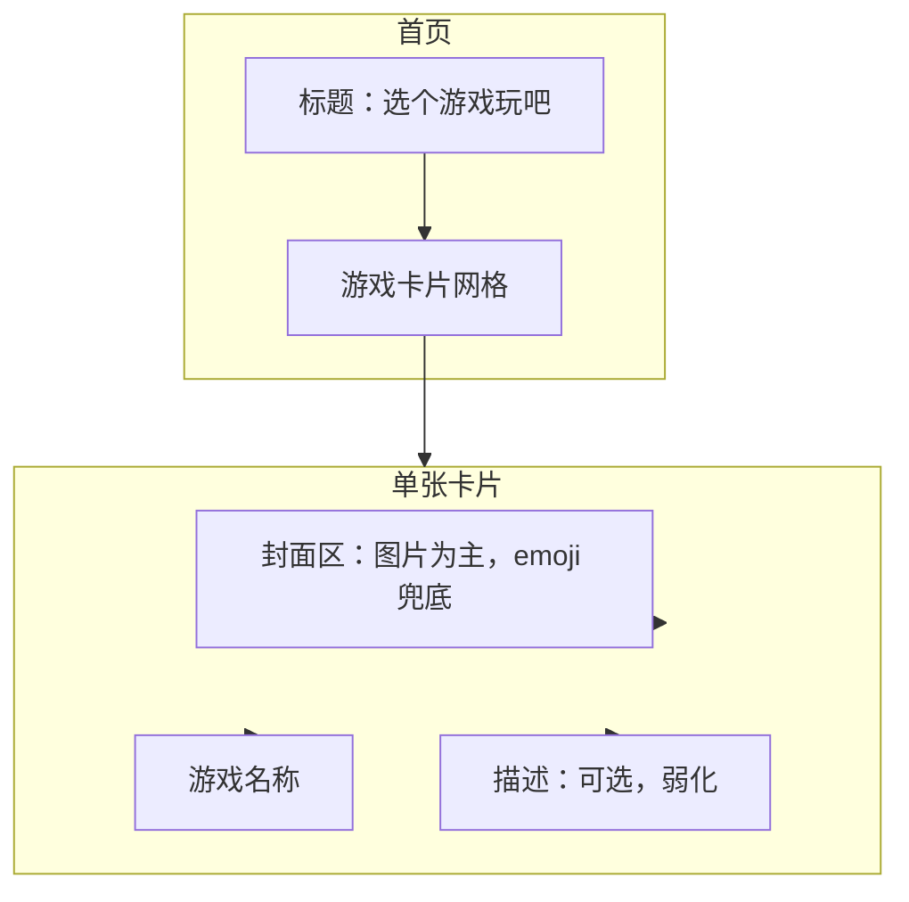

# 面向儿童的游戏列表页设计

**日期：** 2026-02-27  
**目标用户：** 3–10 岁儿童  
**参考：** [2026-02-14-game-index-design.md](2026-02-14-game-index-design.md)、[2026-02-27-kids-level-design.md](2026-02-27-kids-level-design.md)

---

## 1. 现状与目标用户

**现有实现：**

- 根路径 `index.html` 为游戏索引页，糖果梦境风格
- 卡片采用平板/游戏机屏幕样式：预览区（渐变 + emoji）+ 信息区（名称 + 描述）
- 布局：`minmax(220px, 1fr)` 网格，触控区域约 180px 高

**目标用户：** 3–10 岁儿童（与儿童关卡设计一致）

---

## 2. 儿童向设计原则（五项）

**核心洞察：** 儿童对视觉高度敏感，对文字不敏感——封面图优先于文字说明。

| 维度   | 原则           | 具体约束                              |
| ------ | -------------- | ------------------------------------- |
| 视觉优先 | 图片为主、文字为辅 | 每张卡片使用**封面图**作为主视觉，emoji 仅作兜底 |
| 触控   | 大点击区、易识别   | 最小 48×48px，卡片整体作为可点击区             |
| 视觉   | 高对比、大字体、圆角 | 标题 ≥ 24px，名称 ≥ 20px，圆角 ≥ 20px       |
| 认知   | 信息少、流程短    | 首页以封面图 + 游戏名为主，描述可弱化或省略             |
| 情感   | 亲切、安全、趣味   | 柔和色彩、拟人/拟物元素、正向文案               |

---

## 3. 信息架构

**当前保留：** 标题 + 卡片（封面图 + 名称 + 描述）  
**暂不引入：** 分类、难度标签、搜索（保持极简）

---

## 4. 改造任务

### 4.1 封面图（新增，优先）

- **主视觉**：预览区使用 `` 作为封面图，替代或补充 emoji
- **图片来源**：每游戏子目录 `cover.png` 或 `cover.jpg`（如 `tube-pour/cover.png`）
- **尺寸**：封面区高度增至 100–120px，图铺满且 `object-fit: cover`，保持圆角
- **兜底**：无图片时回退到现有 emoji + 渐变背景
- **新增资源**：需为试管倒水准备封面图（可截游戏主界面、或定制插画）

### 4.2 触控与尺寸

- 提高卡片最小高度至约 220px（封面区增高后），保证整体触控区域足够大
- 卡片间距从 24px 增至 28–32px，降低误触
- 保持整张卡片可点击（`<a>` 包住全卡片）

### 4.3 字体与可读性（文字弱化）

- 标题 `.index-title`：`clamp(28px, 5vw, 40px)`（与 tube-pour 一致或略大）
- 游戏名 `.game-name`：18px → 20px，字重 800
- 描述 `.game-desc`：13px → 15px，行高 1.5

### 4.4 文案

- 标题可选：「选个游戏玩吧」/「来玩吧」/「好玩游戏」——偏口语、亲切
- 描述需简短（≤15 字），如试管倒水：「把同色液体倒进同一根试管」

### 4.5 视觉与动效

- 卡片圆角保持 20–24px
- 悬停上浮 8px，过渡 0.22s
- 入场错落淡入（animation-delay）保留
- 可选：点击/按下态（如 `:active` 轻微缩小），增强反馈感

### 4.6 无障碍

- 卡片使用 `aria-label` 描述完整含义，便于屏幕阅读
- 保持 `:focus-visible` 轮廓
- 颜色对比度符合 WCAG AA（文字与背景）

---

## 5. 涉及文件

| 文件                         | 改动                             |
| ---------------------------- | -------------------------------- |
| `index.css`                  | 封面区高度、图片样式、字体、间距、`:active` 反馈 |
| `index.html`                 | 封面图 `` 结构、`aria-label`、兜底逻辑 |
| 各游戏子目录                 | 新增 `cover.png` / `cover.jpg`   |
| `docs/plans/2026-02-14-game-index-design.md` | 补充「儿童向」「封面图优先」设计说明 |

---

## 6. 验收标准

- 每张卡片有封面图（或明确兜底到 emoji）
- 封面区高度 ≥ 100px，图片铺满且圆角
- 卡片最小高度 ≥ 220px，间距 ≥ 28px
- 标题 ≥ 28px，游戏名 ≥ 20px，描述 ≥ 15px
- 每张卡片有 `aria-label`
- 悬停与点击有清晰视觉反馈
- 与 tube-pour 的糖果梦境风格一致
